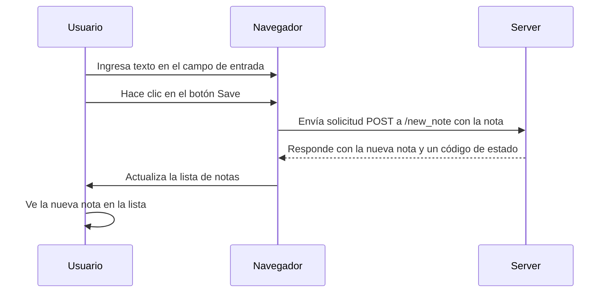

# Diagrama de creación de una nueva nota

```mermaid
sequenceDiagram
    participant Usuario
    participant Navegador
    participant Server

    Usuario->>Navegador: Ingresa texto en el campo de entrada
    Usuario->>Navegador: Hace clic en el botón Save
    Navegador->>Server: Envía solicitud POST a /new_note con la nota
    Server-->>Navegador: Responde con la nueva nota y un código de estado
    Navegador->>Usuario: Actualiza la lista de notas
    Usuario->>Usuario: Ve la nueva nota en la lista
```